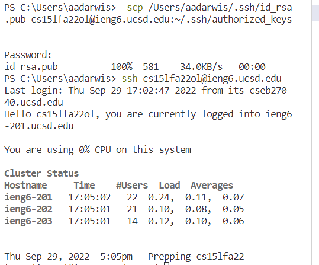

# Week 1 Lab Report: Remote Access

## Step 1: Installing VScode {#step-1}
[Click here](#step-2) to skip to step 2 if you already have VScode installed already.
* (I already had VScode installed from CSE 11 so I didn't have to do this part)

Go to the Visual Studio Code Website [https://code.visualstudio.com/ ](https://code.visualstudio.com/) and follow the instructions for your operating system to install VScode.

After you open VScode, you should see a window like this:


## Step 2: Remotely Connecting {#step-2}

If you are on Windows, you must first install the OpenSSH client:

[Install OpenSSH](https://learn.microsoft.com/en-us/windows-server/administration/openssh/openssh_install_firstuse?tabs=gui)

(Make sure you only install the *client*, and not the server)

* Since I own a MacBook, I skipped this step.
  
Open the terminal and enter the following command, but for your course account:

`$ ssh cs15lfa22zz@ieng6.ucsd.edu`

If it is your first time connecting to the server, you will probable receive the following prompt:
```
⤇ ssh cs15lfa22zz@ieng6.ucsd.edu
The authenticity of host 'ieng6.ucsd.edu (128.54.70.227)' can't be established.
RSA key fingerprint is SHA256:ksruYwhnYH+sySHnHAtLUHngrPEyZTDl/1x99wUQcec.
Are you sure you want to continue connecting (yes/no/[fingerprint])?
```

Go ahead and type yes.

Then, you'll be prompted to enter your password. After entering your password, your terminal should say this:


This tells which remote system we have logged into, the amount of users logged into the different systems, and the load averages.

*However*, many students, including myself, were unable to log into the server. This might have had to do with the fact that we had just reset our passwords and it might have taken a while to update. 

## Step 3: Trying Some Commands {#step-3}

From here, we can now try running a couple commands. Some commands that our lab group tried were:
- pwd - print working directory
  


- cd - change directory


- ls - lists files/directories


Another helpful command to know is `exit`, which will log you out of the remote server.

## Step 4: Moving Files With scp {#step-4}

The next command we started working with is `scp`, which stands for secure copy. This command will allow us to securely copy files and directories between two locations. 

Create the class WhereAmI.java on your computer by typing the following into the terminal:
```
class WhereAmI {
  public static void main(String[] args) {
    System.out.println(System.getProperty("os.name"));
    System.out.println(System.getProperty("user.name"));
    System.out.println(System.getProperty("user.home"));
    System.out.println(System.getProperty("user.dir"));
  }
}
```
Then, compile and run the class with javac and java:
```
javac WhereAmI.java
java WhereAmI
```
Then, type the following command into the terminal

`scp WhereAmI.java cs15lfa22zz@ieng6.ucsd.edu:~/`

In our lab group, some of us ran into problems at this point because we forgot to give the file a path.

If you do it correctly, you should be prompted for your password. After entering your password, the file copy should begin. 


This will tell you how close the file copy is to being completed. For this file, it happened almost instantly, but for larger files it could take much longer.

When we run WhereAmI.java on our own computer, we get the following output


And when we run it on the remote server, we get the following 


This shows that our personal computer is in Windows while the remote server is in Linux. Also, the username varies between the remote server and our personal computer. 

## Step 5: Setting an SSH key {#step-5}

Everytime we log into the server, we have to enter our password. While this may seem like a mild inconvenience, this time will add up especially when logging in and out multiple times during a project. An ssh key will allow us to do just that.

To set this up, do the following:
```
# on client (your computer)
$ ssh-keygen
Generating public/private rsa key pair.
Enter file in which to save the key (/Users/joe/.ssh/id_rsa): /Users/joe/.ssh/id_rsa
Enter passphrase (empty for no passphrase): 
Enter same passphrase again: 
Your identification has been saved in /Users/joe/.ssh/id_rsa.
Your public key has been saved in /Users/joe/.ssh/id_rsa.pub.
The key fingerprint is:
SHA256:jZaZH6fI8E2I1D35hnvGeBePQ4ELOf2Ge+G0XknoXp0 joe@Joes-Mac-mini.local
The key's randomart image is:
+---[RSA 3072]----+
|                 |
|       . . + .   |
|      . . B o .  |
|     . . B * +.. |
|      o S = *.B. |
|       = = O.*.*+|
|        + * *.BE+|
|           +.+.o |
|             ..  |
+----[SHA256]-----+
```

When prompted to choose the file path, hit enter to specify the default path.

If you are on Windows, you must follow extra ssh-add steps from here: https://docs.microsoft.com/en-us/windows-server/administration/openssh/openssh_keymanagement#user-key-generation

- Since I am on Mac, I skipped this step

Then, we copied the public key to your user directory on the server. Once we do this, we will be able to log in and out without a password.



## Step 6: Optimizing Remote Running {#step-6}

Now, we are able to run commands directly on the remote server at the end of an ssh command. Our lab group edited the class so that it would print a statement at the end.


