# Week 3 Lab Report: Servers and Bugs

## Part 1: Simplest Search Engine

Here is the code for my search engine:
```
import java.io.IOException;
import java.net.URI;
import java.util.ArrayList;
import java.util.Arrays;

class SearchEngine implements URLHandler {
    ArrayList<String> stringList = new ArrayList<>();
        public String handleRequest(URI url) {
            if(url.getPath().equals("/")){
                return "List" + Arrays.toString(stringList.toArray());
            }
            else if(url.getPath().contains("/add")) {
                String[] parameters = url.getQuery().split("=");
                if (parameters[0].equals("s")) {
                    stringList.add(parameters[1]);
                }
                return "List" + Arrays.toString(stringList.toArray());
            }
            else {
                ArrayList<String> returnList = new ArrayList<>();
                returnList.clear();
                if(url.getPath().contains("/search")) {
                    String[] parameters = url.getQuery().split("=");
                    if (parameters[0].equals("s")) {
                        for(int i = 0; i < stringList.size(); i ++) {
                            if(stringList.get(i).contains(parameters[1])) {
                                returnList.add(stringList.get(i));
                            }
                        }
                        return "Strings found:" + Arrays.toString(returnList.toArray());
                    }
                }
                return "String not found";
        }
    }
}

class SearchEngineServer {
    public static void main(String[] args) throws IOException {
        if(args.length == 0){
            System.out.println("Missing port number! Try any number between 1024 to 49151");
            return;
        }

        int port = Integer.parseInt(args[0]);

        Server.start(port, new SearchEngine());
    }
}
```
 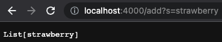

In this screenshot, we are adding the string `strawberry` to the list. This calls the code
```
else if(url.getPath().contains("/add")) {
    String[] parameters = url.getQuery().split("=");
        if (parameters[0].equals("s")) {
            stringList.add(parameters[1]);
        }
```
This code checks to see if the path `add` is in the url, and if it is, then gets the query, which in this case is `s=strawberry`. The code splits the query up around the equals sign, leaving us with two separate strings of `s` and `strawberry`. Then, it inserts the two strings into the array `parameters`. It then checks to ensure index 0 == s, and if it does, adds index 1 of parameters to the ArrayList stringList.

Finally, it displays the list on the screen with the following code:

`return "List" + Arrays.toString(stringList.toArray());`

Let's add a few more strings to the list before the next example.

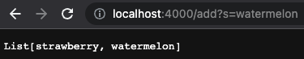
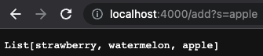
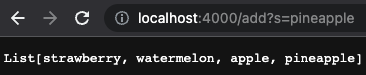

We are also able to search for specific substring in our list of strings, using: 

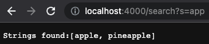

This calls the code:
```
 ArrayList<String> returnList = new ArrayList<>();
    returnList.clear();
        if(url.getPath().contains("/search")) {
            String[] parameters = url.getQuery().split("=");
                if (parameters[0].equals("s")) {
                    for(int i = 0; i < stringList.size(); i ++) {
                        if(stringList.get(i).contains(parameters[1])) {
                            returnList.add(stringList.get(i));
                        }
                     }
                    return "Strings found:" + Arrays.toString(returnList.toArray());
```
This creates a new ArrayList called returnList that we will add our strings that contain the substring we are looking for to. I clear it at the beginning because we want a blank list everytime we are searching for a new substring. It then checks to see if the `search` path is in the url, and if so, it gets the query. In this case, the query is `s=app`. The string is split around the equals sign, and places it into an array, leaving us with two separate strings of `s` and `app`. It then checks to make sure the first string is == s, and if so, it loops through the list of strings and checks each one to see if it contains the substring `app`. If it contains the string, it adds it to the ArrayList `returnList`. Finally, it displays the strings found with the code:

`return "Strings found:" + Arrays.toString(returnList.toArray());`

##Part 2: Bugs and Symptoms

### Reverse in Place

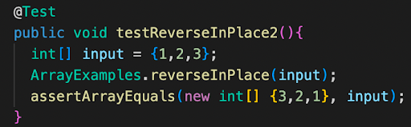
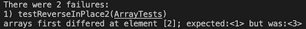
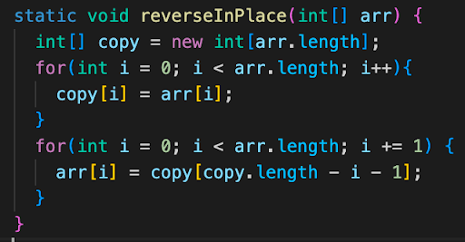

This test was failing because it was changing the values at the start of the array to match the last one, so when it would try change the last value to match the first value, it was changing it to the already updated reversed value. I fixed this by making a new array that was a copy of the original array, and used that as a reference instead.

### Filter

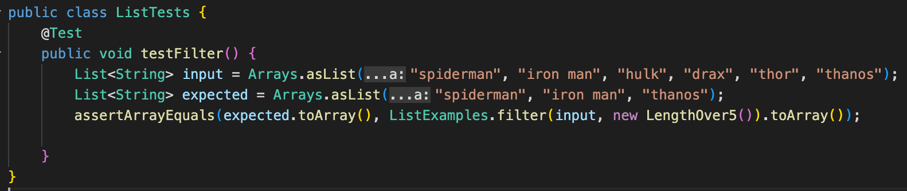
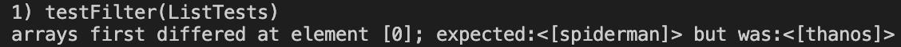
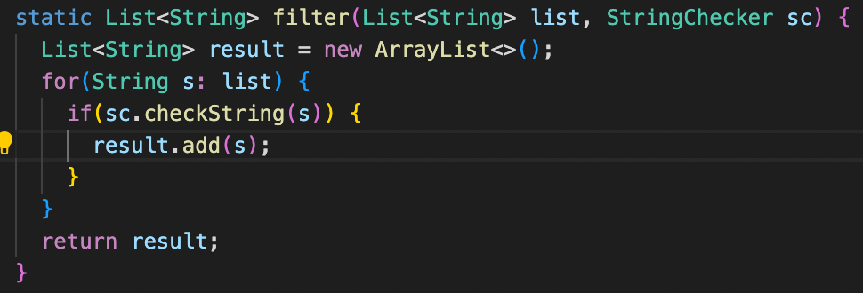

This test was failing because it is supposed to filter the list of strings using the string checker if the string checker returns true in the same order as the input list. In this case, the string checker returns true if the given string is over 5 characters. However, the output list is actually in reverse order because every string that is added to it is added at index 0, causing it to be in the reverse order. We fix this simply by removing the 0, causing the string to be added on to the end of the list. 