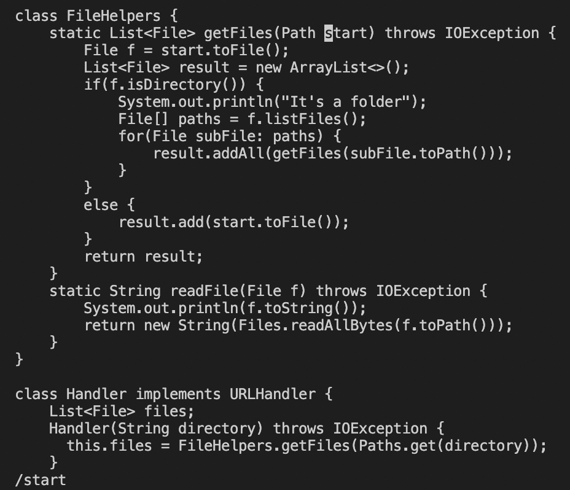
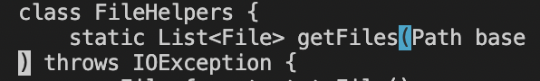
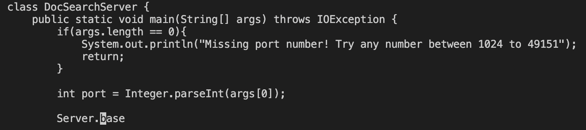

# Week 7 Lab Report: Vim

## Part 1: 

### Changing the name of the start parameter and its uses to base: 

The shortest sequence of vim commands we came up with for this task was:

`vim DocSearchServer.java<Enter>/start<Enter>cgnbase<Esc>n.n.n.:wq`

`vim DocSearchServer.java<Enter>` opens the DocSearchServer.java file in vim.

`/start<Enter>` searches for the first instance of start and jumps the cursor to it

`cgnbase<Esc`> deletes start and replaces it with base

`n.n.n.` repeats the previous command for the remaining instances of start

`:wq` saves our changes and exits vim

## Part 2: 

First, to make the edit in Visual Studio Code and then scp the file onto the remote server took me around 35 seconds. However, to use vim on the remote server and make the change there was considerably shorter, at around only 20 seconds

Personally, with my current coding knowledge and experience, I think I would still prefer to make the edits on my personal computer and then upload it to the remote server after. This is mainly because I am still unfamiliar with using vim but I think as I grow more accustomed to it I would definitely be more inclined to use it in the future, as it is much more efficient

Some details about the project that may influence my decision could be the size of the project, as a larger project would take much longer to upload onto the remote server, so it would be much faster to make the changes directly on the remote server. 
