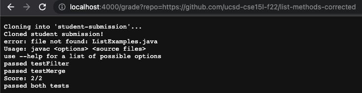
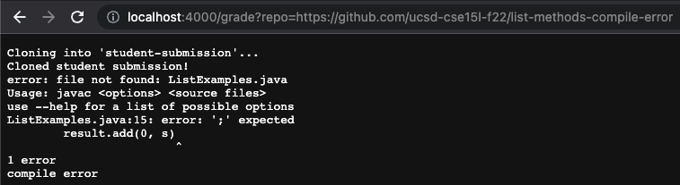
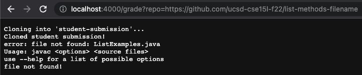

# Week 9 Lab Report: Grading Script

Here is the code for my grading script:

```
rm -rf student-submission
git clone $1 student-submission
echo "Cloned student submission!"
error=0
javac -target 1.8 -cp ".:lib/hamcrest-core-1.3.jar:lib/junit-4.13.2.jar" ListExamples.java TestListExamples.java
CP="..:../lib/hamcrest-core-1.3.jar:../lib/junit-4.13.2.jar"
cd student-submission

ls -a > fileList.txt
if [ $(grep -c "ListExamples.java" fileList.txt) -eq 0 ]
then
    echo "file not found!"
    exit 1
fi

javac -cp $CP *.java

if [ $? -ne 0 ]
then
    echo "compile error"
    exit 1
fi

cp ListExamples.class ..
java -cp $CP org.junit.runner.JUnitCore TestListExamples > error.txt
cp ../ListExamples.class .
if [ $(grep -c "testFilter" error.txt) -ne 0 ]
then
    let "error+=1"
    echo "failed testFilter"
else
    echo "passed testFilter"
fi

if [ $(grep -c "testMerge" error.txt) -ne 0 ]
then
    let "error+=1"
    echo "failed testMerge"
else
    echo "passed testMerge"
fi

if [ $error -eq 2 ]
then
    echo "0/2"
    echo "failed both tests"
fi

if [ $error -eq 1 ]
then
    echo "1/2"
    echo "passed 1 test"
fi

if [ $error -eq 0 ]
then
    echo "Score: 2/2"
    echo "passed both tests"
fi
```

## Example One: list-methods-corrected



## Example Two: list-methods-compile-error



## Example Three: list-methods-filename



## Example Three Trace:

First, the script clones the student submission and echoes that it has successfully cloned the submission. Because, it is successful, the return code was zero for this command. Then, it compiles the code and changes into the correct directory. The return code is also zero for both these commands. Then it uses ls -a to find all the files and redirects the output to a file called fileList.txt. The return code for this is once again zero because it runs properly without any error. Next, there is an if statement to check if the correct files are present in fileList.txt. In this example, the file is incorrectly named, so it can not find the file. It checks to see if grep can find the ListExamples.java file and if it's return code is equal to zero. If so, that means the file is present and it proceeds to the rest of the code. However, since it cannot find the file in this example, grep returns a return code of a non zero value, so the if statement echoes that the file was not found and returns an exit code of 1.